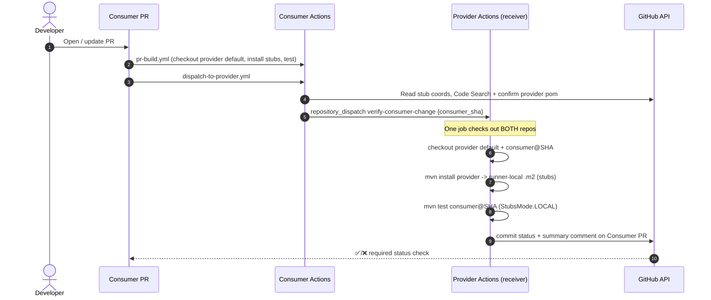

# demo-contract-consumer

A minimal Spring Boot **consumer** that calls the provider's greetings endpoint
and verifies against its stubs using **Spring Cloud Contract Stub Runner** with
`StubsMode.LOCAL` — **no broker**, **no artifact publishing**.

- Java 21, Maven, Spring Boot 3.4.1, Spring Cloud 2024.0.0.
- Client: `GreetingClient` → `GET /api/greetings/{name}`.
- Integration test: `GreetingClientStubRunnerTest` replays the provider's LOCAL
  stubs.
- Provider stub coordinates are **overridable properties**, not hard-coded
  through the code (`provider.stubs.groupId/artifactId/version` in `pom.xml`,
  filtered into `src/test/resources/application.properties`).

## What the demo proves / does not prove

**Proves:** A consumer PR (or an upstream provider PR) triggers an automated flow
that runs the **real consumer tests** against provider stubs built from an exact
commit, in a runner-local `.m2`, and reports pass/fail on the PR — no manual
Maven, nothing published.

**Does not prove:** Full discovery of all provider/consumer relationships, or
correctness of runtime concerns outside the contract. Building the provider and
"installing a jar" does not verify consumer behaviour; these workflows explicitly
run the changed consumer tests.

## Architecture / PR verification flow



## Local test instructions

The consumer needs the provider stubs in your local `.m2` first:

```bash
# 1) In the provider repo:
( cd ../demo-contract-provider && mvn clean install )

# 2) Then run the consumer tests (positive scenario):
mvn clean test

# Override the stub version to match a specific provider build:
mvn clean test -Dprovider.stubs.version=1.0.0-SNAPSHOT
```

### Positive and breaking scenarios

- **Positive** — `GreetingClientStubRunnerTest`: runs by default, asserts
  `Hello Adam` from the LOCAL stub.
- **Breaking** — `BreakingConsumerScenarioTest`: skipped by default; enable with:

  ```bash
  mvn test -Pbreaking-demo
  ```

  It calls an **uncontracted path** (`/api/salutations/{name}`) the stub does not
  serve, demonstrating that a consumer change to a different path / unsupported
  response is detected against the provider stubs.

A real breaking consumer change (e.g. editing `GreetingClient` to call the wrong
path or expect a missing field) makes `GreetingClientStubRunnerTest` fail — which
is exactly what cross-repo verification reports on the PR.

## Workflows

| File | Trigger | Purpose |
|------|---------|---------|
| `pr-build.yml` | `pull_request`, `workflow_dispatch` | Checkout provider default, install stubs to runner-local `.m2`, run consumer tests. |
| `dispatch-to-provider.yml` | `pull_request`, `workflow_dispatch` | Discover the upstream provider from stub coords and dispatch verification. |
| `verify-against-provider.yml` | `repository_dispatch: verify-provider-change`, `workflow_dispatch` | Receiver for the **provider PR flow**: build provider@SHA stubs locally, run consumer tests, report to provider PR. |

## GitHub App / PAT setup

Same model as the provider. Production uses a **GitHub App** on both repos; a
fine-grained **PAT** is a demo-only fallback.

### Required GitHub App permissions (verify against current GitHub docs)

| Scope | Access | Why |
|-------|--------|-----|
| **Metadata** | Read | Always required. |
| **Contents** | Read + write | `Contents: write` required to create `repository_dispatch`; read to check out. |
| **Commit statuses** | Read + write | Branch-protection status check. |
| **Pull requests** | Read + write | Single summary comment. |
| **Checks** | Write | Only if using Check Runs instead of commit statuses. |

> Verified: creating a repository dispatch event requires `Contents: write`
> (https://docs.github.com/en/rest/repos/repos#create-a-repository-dispatch-event).

### Repository variables and secrets

| Name | Kind | Notes |
|------|------|-------|
| `APP_ID` | Variable | GitHub App id. Empty → PAT fallback. |
| `PARTNER_REPO` | Variable | `owner/demo-contract-provider`. Also used by `pr-build.yml` to fetch stubs. |
| `APP_PRIVATE_KEY` | Secret | GitHub App private key (PEM). |
| `DISPATCH_PAT` | Secret | Fine-grained PAT, demo only. |

## Dependency discovery (and its limits)

See the provider README — identical caveats. The consumer discovers its provider
from the Spring Cloud Contract stub coordinates, confirms the candidate's
`pom.xml`, and falls back to `PARTNER_REPO`. Code Search is text-based and not
authoritative; production likely needs a generated typed service graph with an
audited manual override.

## Security model / limitations

- Fork PRs never receive credentials.
- Payloads validated (SHA/repo/PR) to block repository/command injection.
- Verification always uses the originating PR SHA, never a branch name.
- Least-privilege `permissions:`, `timeout-minutes`, and `concurrency` cancel
  superseded runs. App tokens scoped to the two repos.

## Troubleshooting

- **`StubNotFoundException`**: provider not installed into the job `.m2`, or
  `provider.stubs.version` mismatch.
- **Filtered property literal (`@...@`) in test config**: run through Maven
  (`mvn test`), not the IDE without resource filtering.
- **Discovery empty**: set `PARTNER_REPO` or use the `workflow_dispatch` inputs.

## Remote setup (run yourself — not done automatically)

```bash
cd demo-contract-consumer
git init && git add . && git commit -m "Initial consumer demo"
gh repo create demo-contract-consumer --private --source=. --remote=origin --push
gh variable set PARTNER_REPO --body "<you>/demo-contract-provider"
gh variable set APP_ID       --body "<app-id>"
gh secret   set APP_PRIVATE_KEY < app-private-key.pem
gh secret   set DISPATCH_PAT  --body "<fine-grained-pat>"
# Branch protection: require the 'contract-verification/provider' status check.
```
