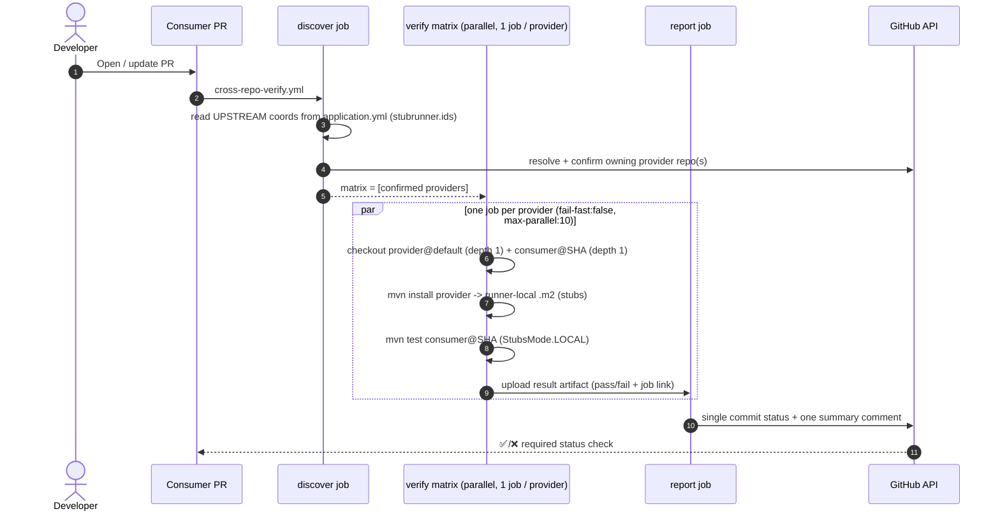

# demo-contract-consumer

A minimal Spring Boot **consumer** that calls the provider's greetings endpoint
with a JSON payload and verifies against its stubs using **Spring Cloud
Contract Stub Runner** with `StubsMode.LOCAL` - **no broker**, **no artifact
publishing**.

- Java 21, Maven, Spring Boot 3.4.1, Spring Cloud 2024.0.0.
- Client: `GreetingClient` → `POST /api/greetings` with `{"name":"..."}`.
- Integration test: `GreetingClientStubRunnerTest` replays the provider's LOCAL
  stubs.
- Provider stub coordinates are **overridable properties**, not hard-coded
  through the code. The **upstream dependency is declared once** in
  `src/test/resources/application.yml` (`stubrunner.ids`) — read by both Spring
  Cloud Contract Stub Runner and the CI discovery step. The version is a
  placeholder (`${provider.stubs.version:1.0.0-SNAPSHOT}`) forwarded from Maven
  into the test JVM by surefire, so CI can override it per build.

## What the demo proves / does not prove

**Proves:** A consumer PR (or an upstream provider PR) triggers an automated flow
that runs the **real consumer tests** against provider stubs built from an exact
commit, in a runner-local `.m2`, and reports pass/fail on the PR — no manual
Maven, nothing published. The payload contract means request-field and
response-field changes both fail visibly.

**Does not prove:** Full discovery of all provider/consumer relationships, or
correctness of runtime concerns outside the contract. Building the provider and
"installing a jar" does not verify consumer behaviour; these workflows explicitly
run the changed consumer tests.

## Architecture / PR verification flow



> Each matrix job checks out only **two** repos with `fetch-depth: 1`; providers
> are usually one, so this is fast. See the root presentation guide for the full
> performance rationale.

## Local test instructions

The consumer needs the provider stubs in your local `.m2` first:

```bash
# 1) In the provider repo:
( cd ../demo-contract-provider && mvn clean install )

# 2) Then run the consumer tests (positive scenario):
mvn clean test

# Override the stub version to match a specific provider build:
mvn clean test -Dprovider.stubs.version=1.0.0-SNAPSHOT
```

### Positive and breaking scenarios

- **Positive** — `GreetingClientStubRunnerTest`: runs by default, asserts
  `Hello Team` from the LOCAL stub.
- **Breaking** — `BreakingConsumerScenarioTest`: skipped by default; enable with:

  ```bash
  mvn test -Pbreaking-demo
  ```

  It sends an **uncontracted JSON payload** (`{"fullName":"Team"}`) the stub does
  not serve, demonstrating that a consumer change to a different request shape
  or unsupported response is detected against the provider stubs.

A real breaking consumer change (e.g. editing `GreetingClient` to send the wrong
field name or expect a missing field) makes `GreetingClientStubRunnerTest` fail
— which is exactly what cross-repo verification reports on the PR.

## Workflows

| File | Trigger | Purpose |
|------|---------|---------|
| `pr-build.yml` | `pull_request`, `workflow_dispatch` | Checkout provider default, install stubs to runner-local `.m2`, run consumer tests. |
| `cross-repo-verify.yml` | `pull_request`, `workflow_dispatch` | `discover` upstream providers from `application.yml` (`stubrunner.ids`) → `verify` matrix (parallel, one job per provider; builds provider stubs, runs this consumer's PR tests) → `report` single status + summary comment. |

`cross-repo-verify.yml` accepts a `workflow_dispatch` input (`provider_repo`) to
verify against a single provider manually.

> **Alternative (cross-org / partner-owned):** swap the matrix for a
> `repository_dispatch` to the provider repo plus a receiver workflow on its
> default branch (needs `Contents: write`). The in-repo matrix is used here for
> speed and self-containment.

## GitHub App setup (the realistic identity)

The workflows authenticate as a **GitHub App** — an independent bot actor owned
by the account, not tied to any individual developer. See the provider README's
"GitHub App setup" for the full rationale and step-by-step creation runbook; the
App is the **same single App installed on both repos**. A fine-grained **PAT** is
documented only as a demo-only fallback.

### Required GitHub App permissions (verified against current GitHub REST docs)

All are **repository** permissions; install the App on **both** demo repos.

| Permission | Access | Why | Endpoint that requires it |
|------------|--------|-----|---------------------------|
| **Metadata** | Read | Mandatory baseline for every App. | — |
| **Contents** | Read and write | *Read*: check out this repo + the provider at the PR SHA, read `pom.xml`, run Code Search. *Write*: the nightly generator pushes its `chore/service-graph` branch. | [Get content](https://docs.github.com/en/rest/repos/contents) / [Create/update file](https://docs.github.com/en/rest/repos/contents) |
| **Pull requests** | Read and write | Create/update the single summary comment; the generator opens its PR. | [Create an issue comment](https://docs.github.com/en/rest/issues/comments) (a PR is an issue) |
| **Commit statuses** | Read and write | Post the `contract-verification` status branch protection requires. | [Create a commit status](https://docs.github.com/en/rest/commits/statuses) |

## Dependency discovery (and its limits)

Three tiers, in priority order:

1. **Service graph (Tier-3, preferred)** - `.github/service-graph.json`, read
   first by the `discover` job. `upstreamProviders` is regenerated nightly by
   `.github/workflows/service-graph-generator.yml` from `application.yml`
   (`stubrunner.ids`) resolved via confirmed Code Search;
   `manualOverrides.upstreamProviders` is preserved. Bare names get the repo
   owner inferred at runtime.
2. **`PARTNER_REPO`** - deterministic fallback.
3. **application.yml coordinates + Code Search** — the consumer's upstream is
   declared authoritatively in `stubrunner.ids`; Code Search only resolves which
   repo *produces* those coordinates, and is text-based / not authoritative.

Every candidate is **confirmed** by reading its `pom.xml` before verification.
The generator opens a PR rather than pushing to `main`, so changes are audited.

## Security model / limitations

- Fork PRs never receive credentials.
- Payloads validated (SHA/repo/PR) to block repository/command injection.
- Verification always uses the originating PR SHA, never a branch name.
- Least-privilege `permissions:`, `timeout-minutes`, and `concurrency` cancel
  superseded runs. App tokens scoped to the two repos.

## Troubleshooting

- **`StubNotFoundException`**: provider not installed into the job `.m2`, or
  `provider.stubs.version` mismatch.
- **Filtered property literal (`@...@`) in test config**: run through Maven
  (`mvn test`), not the IDE without resource filtering.
- **Discovery empty**: set `PARTNER_REPO` or use the `workflow_dispatch` inputs.
